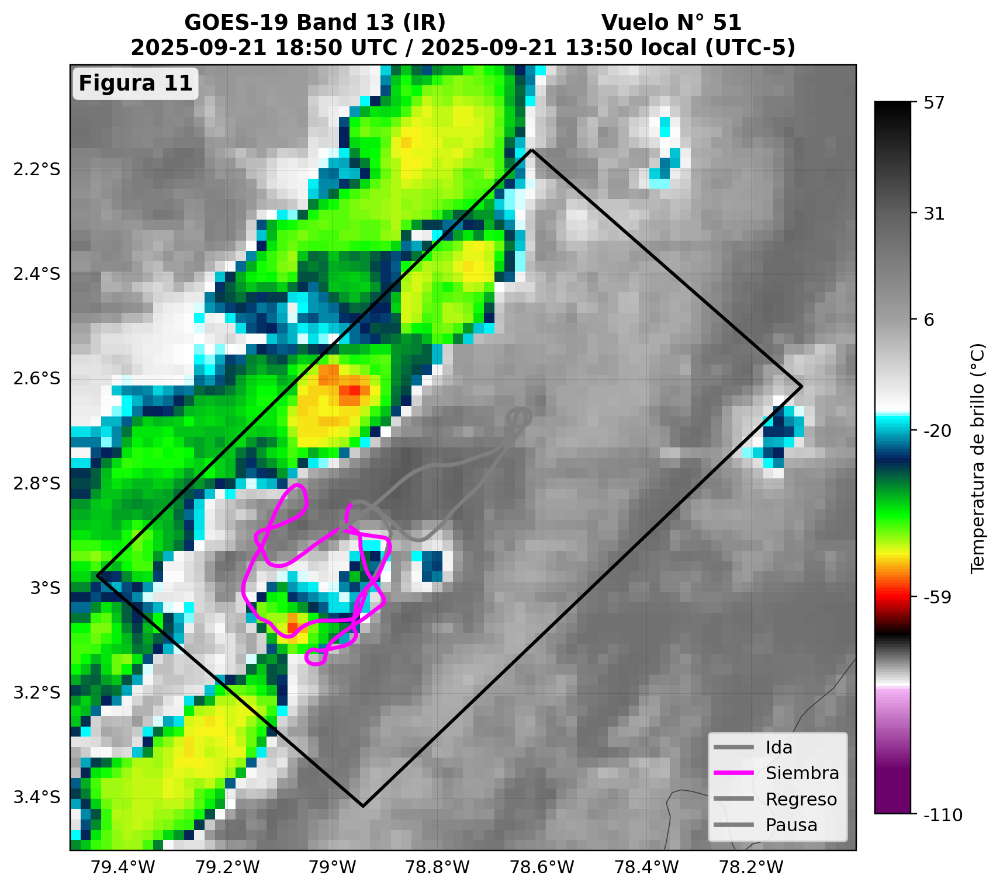
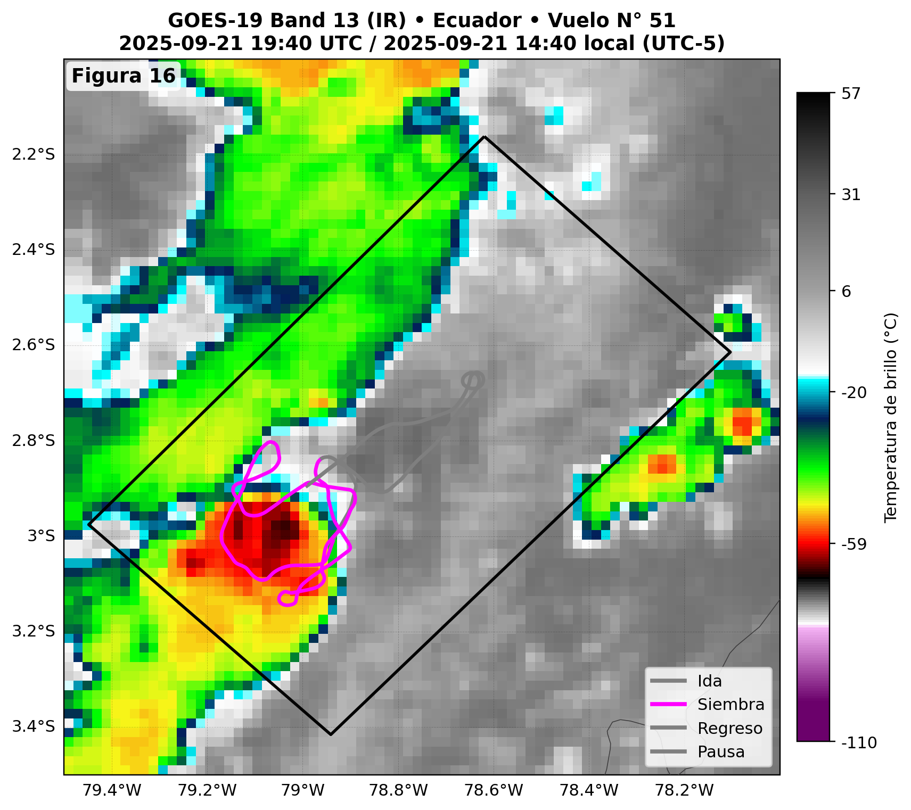
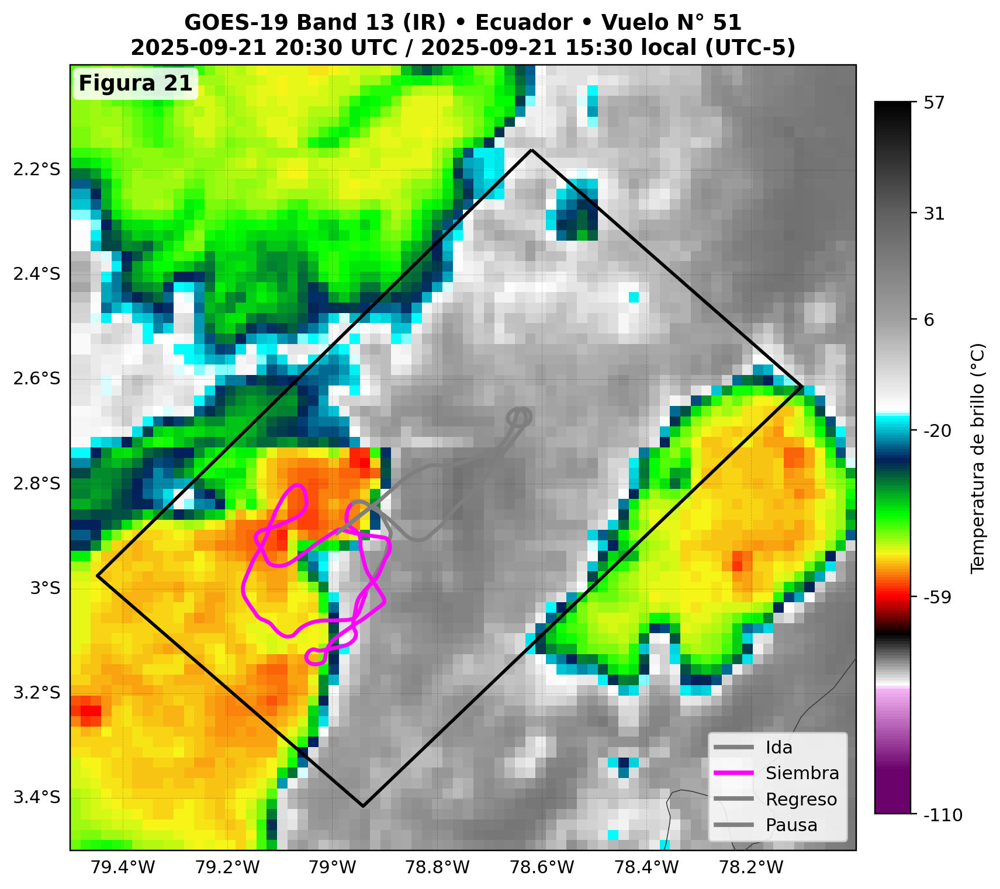

# Análisis Satelital realizado para un evento convectivo dentro del dominio de estudio (2025)

Este repositorio reúne el código, notebooks y ejemplos de productos gráficos utilizados para el **monitoreo y la evaluación de campañas de estimulación de nubes (cloud seeding)** durante 2025, a partir de imágenes satelitales **GOES-19 (banda 13)**.

El objetivo principal es mostrar mi forma de trabajo integrando:
- análisis meteorológico operativo,
- procesamiento de datos satelitales en Python,
- y generación de productos visuales para la toma de decisiones.

---

## ✨ Objetivos del proyecto

- Identificar y seguir sistemas convectivos relevantes para las operaciones de siembra.
- Generar secuencias **antes–durante–después** asociadas a vuelos específicos.
- Superponer trayectorias de vuelo y áreas de interés sobre campos satelitales.
- Dejar un flujo de trabajo reproducible que pueda adaptarse a otras campañas o regiones.

---

## 📂 Estructura del repositorio

```text
.
├── data/
│   ├── raw/          # Datos crudos GOES-19 (no incluidos por tamaño)
│   └── processed/    # Datos recortados/preprocesados
├── figures/          # Figuras de ejemplo del análisis
├── notebooks/        # Notebooks del flujo de trabajo
├── src/              # Funciones reutilizables en Python
├── LICENSE
├── README.md
└── requirements.txt

---

## 📊 Ejemplo de análisis GOES-19: Evolución convectiva durante el vuelo N° 51

A continuación se presenta un ejemplo detallado del análisis satelital realizado para el **Vuelo N° 51** en el dominio geográfico de estudio. Se muestra la evolución de la nube convectiva objetivo en tres momentos clave del proceso de siembra: **antes**, **durante** y **después** del vuelo, utilizando imágenes de la banda infrarroja **GOES-19 Band 13 (IR)**.

Estas figuras representan claramente:

- el desplazamiento y desarrollo convectivo del sistema,
- la ubicación de la trayectoria del avión (ida, siembra, regreso, pausa),
- y la interacción entre el vuelo y la estructura convectiva.

---

### 🟦 Antes de la siembra — 18:50 UTC  
**Figura 11**  
El sistema convectivo comienza a organizarse. Se aprecia un núcleo frío con temperaturas entre −50°C y −60°C, asociado a la fase inicial del desarrollo vertical.



---

### 🟪 Durante la siembra — 19:40 UTC  
**Figura 16**  
El piloto ejecuta el tramo de siembra dentro del núcleo convectivo. Se observa intensificación en el sector suroeste del polígono, con un crecimiento vertical marcado y temperaturas de brillo que alcanzan valores inferiores a −65°C.



---

### 🟧 Después de la siembra — 20:30 UTC  
**Figura 21**  
La celda convectiva evoluciona y se expande, mostrando una estructura más madura. Continúan las bajas temperaturas de brillo y aparecen nuevos máximos convectivos al este y sureste del dominio.



---

### ✨ Interpretación general

El análisis temporal revela:

- un **desarrollo convectivo activo** durante todo el periodo del vuelo,  
- una **zona óptima de intervención** dentro del núcleo más frío,  
- y una evolución post-siembra consistente con la intensificación observada en la estructura convectiva.

Este tipo de análisis permite evaluar de manera visual y cuantitativa los vuelos de estimulación de nubes, contribuyendo a la documentación técnica y a la toma de decisiones operativas.

---

---

## 🔄 Pipeline del proyecto (flujo de trabajo)

Este proyecto sigue un flujo de trabajo ordenado y reproducible que permite analizar eventos de siembra de nubes utilizando imágenes GOES-19.  
El proceso completo —desde la obtención de los datos hasta la documentación del caso— se resume en el siguiente pipeline:

### 🛫 1. Selección del evento y ventana temporal  
Identificación del vuelo de siembra y determinación de los intervalos **antes–durante–después** a analizar.

### 📥 2. Descarga de imágenes GOES-19 (Banda 13)  
Obtención automática de las escenas satelitales correspondientes al rango temporal seleccionado.

### 🧭 3. Preprocesamiento geoespacial  
- Recorte al dominio geográfico de estudio  
- Reproyección de coordenadas  
- Conversión de formatos  
- Selección de la banda IR (B13)

### 🔍 4. Análisis temporal de la nube convectiva  
Evaluación de la evolución del sistema: desplazamiento, intensificación, expansión y cambios térmicos.

### ✈️ 5. Integración con la trayectoria del vuelo  
Superposición de los tramos **ida**, **siembra**, **regreso** y **pausa** sobre el campo satelital.

### 🎨 6. Visualización y generación de figuras  
Creación de mapas antes–durante–después, secuencias temporales y composiciones espaciales.

### 📝 7. Documentación del caso  
Interpretación de los resultados y elaboración de productos gráficos utilizados en reportes operativos.

---

---

## 📦 Organización del código (`src/`)

Además del notebook principal, el proyecto cuenta con una pequeña librería interna en la carpeta `src/`, que separa la lógica en tres componentes:

- `download_goes.py`  
  Funciones para la **descarga de archivos** (por ejemplo escenas GOES-19) a partir de URLs:
  - manejo de carpetas de salida,
  - verificación de archivos existentes,
  - descarga robusta con `requests`.

- `preprocess_goes.py`  
  Herramientas de **preprocesamiento**:
  - apertura de escenas con `xarray`,
  - selección de la variable principal (por ejemplo temperatura de brillo),
  - recorte a un dominio geográfico definido (lat/lon),
  - función de flujo rápido `prepare_scene` para abrir + seleccionar + recortar.

- `plot_goes.py`  
  Funciones de **visualización en mapas** usando `matplotlib` y `cartopy`:
  - ploteo del campo satelital (Banda 13 u otra),
  - configuración básica de mapa (líneas de costa, grilla),
  - posibilidad de sobreponer la **trayectoria de vuelo**,
  - guardado de figuras listas para informes.

Esta organización permite reutilizar el mismo código en distintos notebooks y casos de estudio, manteniendo el análisis más limpio y modular.


